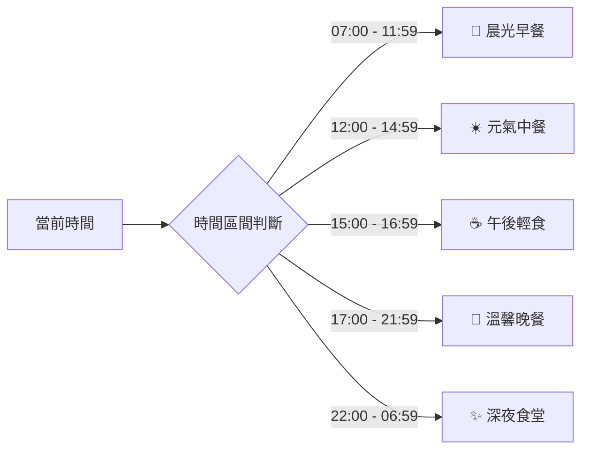

# 🎨 Family Kitchen 2.0 設計系統規範書 (Design System Specification)

> 📌 **系統定位**：家庭智慧備料計算機、飲食紀錄 Tracker 與智慧冰箱管理系統。  
> 🌿 **設計哲學**：**韓系奶油極簡（Korean Creamy Minimalist）** 結合 **減法美學** 與 **防焦慮視覺（Anti-Anxiety Design）**。以溫潤的大地奶灰、柔和飽和度的人物專屬色、毛玻璃微光與細膩微互動，為家庭日常帶來從容、優雅且高效的慢生活料理體驗。

---

## 目录 (Table of Contents)
1. [設計原則與哲學 (Design Principles)](#1-設計原則與哲學-design-principles)
2. [色彩系統權威矩陣 (Color System & Tokens)](#2-色彩系統權威矩陣-color-system--tokens)
3. [排版與文字階層 (Typography & Hierarchy)](#3-排版與文字階層-typography--hierarchy)
4. [間距、圓角與陰影 (Spacing, Radii & Shadows)](#4-間距圓角與陰影-spacing-radii--shadows)
5. [狀態標籤與回饋機制 (Status & Feedback Indicators)](#5-狀態標籤與回饋機制-status--feedback-indicators)
6. [核心元件庫規格 (Component Library Specs)](#6-核心元件庫規格-component-library-specs)
   - 6.1 膠囊元件體系 (Capsule System)
   - 6.2 03 備料大白板 (Portions Whiteboard)
   - 6.3 04 成員專屬卡片 (Member Portions Card)
   - 6.4 飲食進度條與快捷美食庫 (Tracker Progress & Favorites)
   - 6.5 智慧採買清單全螢幕視窗 (Shopping Cart Modal)
   - 6.6 統一 AI 視覺取景視窗 (Camera Vision Modal)
7. [時段智慧推薦規則 (Time-Slot Recommendation Engine)](#7-時段智慧推薦規則-time-slot-recommendation-engine)
8. [佈局與手勢操作規範 (Layout & Motion Standards)](#8-佈局與手勢操作規範-layout--motion-standards)

---

## 1. 設計原則與哲學 (Design Principles)

1. **黃金首頁（Above the Fold）**：
   - 捨棄沉重的 Header 大 Banner，把手機首頁第一屏 100% 留給「料理選擇」與「核心食材選取」，開頁即用、零多餘滾動。
2. **減法抗焦慮（Calm & Clean）**：
   - 移除所有干擾性圖示（如多餘的 ⭐ 星號、雜亂的裝飾線條）。
   - 透過「白底、奶灰、柔和綠框」等乾淨色彩，降低做飯時的心理負擔。
3. **大拇指友善（Thumb-Zone Ergonomics）**：
   - 底部常駐「毛玻璃單行橫排按鈕」，核心操作均在單手大拇指舒適觸及區。
4. **實體感微互動（Tactile Feedback）**：
   - 短按（Toggle）與 750ms 重長按（Inspect）明確分流，輔以微縮放與平滑位移過渡。

---

## 2. 色彩系統權威矩陣 (Color System & Tokens)

### 2.1 基礎介面色 (Base Interface Tokens)

| Token 名稱 | 色碼 (HEX / RGBA) | 用途與說明 |
| :--- | :--- | :--- |
| `--color-bg-base` | `#F8F6F0` (暖奶米灰) | 全域頁面底色，營造溫潤居家感 |
| `--color-surface-card` | `#FFFFFF` (純白) | 卡片、Modal、白板等主要容器底色 |
| `--color-surface-soft` | `#F3F0EA` (軟柔灰) | 次級區塊底色、無庫存/停用背景 |
| `--color-border-subtle` | `#E8E5DD` (淡灰線) | 卡片邊框、分隔線、預設膠囊邊框 |
| `--color-text-main` | `#2D2A26` (炭墨褐) | 主要標題、數值、按鈕文字 |
| `--color-text-muted` | `#8C867A` (晨霧灰) | 次要標籤、單位、輔助說明文字 |

### 2.2 家庭成員識別色 (Family Profile Accents)

| 成員 (Member) | 代表色 (Token) | 色碼 (HEX) | 應用情境 |
| :--- | :--- | :--- | :--- |
| **Bebe (😊)** | 暖陽金黃 (`--accent-bebe`) | `#FFCA60` | Bebe 專屬卡片標記、重點 CTA 亮黃按鈕 |
| **Ariel / 樂樂 (❤️)** | 珊瑚朱紅 (`--accent-ariel`) | `#E16262` | 樂樂專屬卡片標記、刪除/警示標籤 |
| **Jason / J (🪨)** | 湖水藍綠 (`--accent-jason`) | `#7DC7CC` | Jason 專屬卡片標記、高蛋白特調標籤 |

### 2.3 狀態與健康信號色 (Semantic Status Tokens)

| 狀態名稱 | 色碼 (HEX) | 語意說明 |
| :--- | :--- | :--- |
| **🟢 安全 / 達標 (Safe)** | `#10B981` (薄荷綠) | 庫存充足、營養數值在安全預算內 |
| **⚫️ 累積中 (In Progress)** | `#6B7280` (冷炭灰) | 單餐攝取未達全天目標值 |
| **🔴 超標 (Over Limit)** | `#EF4444` (警示紅) | 全天熱量/鈉/脂肪攝取超過預算上限 |

---

## 3. 排版與文字階層 (Typography & Hierarchy)

* **英數專數字體**：`Inter`, `-apple-system`, `sans-serif`
* **中文字體**：`Noto Sans TC`, `PingFang TC`, `微軟正黑體`, `sans-serif`

| 層級 (Level) | 尺寸 (Size) | 字重 (Weight) | 行高 (Line Height) | 範例應用 |
| :--- | :--- | :--- | :--- | :--- |
| **Display (H1)** | 22px / 1.375rem | 700 (Bold) | 1.2 | 頁面主標題 `FAMILY KITCHEN 2.0` |
| **Title (H2)** | 16px / 1.0rem | 700 (Bold) | 1.3 | 區塊標題 `01 DISH 選擇料理` |
| **Subtitle (H3)** | 14px / 0.875rem | 600 (SemiBold)| 1.4 | 營養素分類標題、成員名稱 |
| **Body (內文)** | 14px / 0.875rem | 400 (Regular) | 1.5 | SOP 步驟、食材名稱、清單文字 |
| **Caption (標註)** | 12px / 0.75rem | 500 (Medium) | 1.4 | 單位標籤、基準值 `(100g)`、時段徽章 |
| **Number (數據)** | 18px ~ 24px | 700 (Bold) | 1.1 | 備料克數、總熱量數值 |

---

## 4. 間距、圓角與陰影 (Spacing, Radii & Shadows)

### 4.1 圓角規範 (Border Radii)
* **膠囊 (Capsules / Tags)**：`20px` (完全圓角 Pill Shape)
* **卡片 / 大白板 (Cards / Modals)**：`16px ～ 20px` (溫潤大圓角)
* **小型按鈕 / 輸入框 (Inputs / Buttons)**：`8px ～ 12px`

### 4.2 陰影系統 (Shadow Elevation)
* **Card Shadow (卡片浮起)**：`0 4px 16px rgba(45, 42, 38, 0.04)`
* **Modal Shadow (彈窗浮起)**：`0 12px 32px rgba(45, 42, 38, 0.12)`
* **Active Glow (選取微光)**：`0 0 0 3px rgba(16, 185, 129, 0.15)`

---

## 5. 狀態標籤與回饋機制 (Status & Feedback Indicators)

```
[ 🟢 安全/達標 ]  --> #10B981 (綠色圓點 / 綠色文字)
[ ⚫️ 進行中/未滿 ] --> #6B7280 (黑色圓點 / 灰字)
[ 🔴 超標警示 ]    --> #EF4444 (紅色圓點 / 紅色文字)
```

1. **五大營養素全天預算燈號**：
   - 熱量、蛋白質、碳水化合物、脂肪、鈉含量均實時計算累計值，並動態賦予 🟢 / ⚫️ / 🔴 狀態。
2. **Modal 背景鎖定（Body Scroll Lock）**：
   - 任何 Modal（食材詳情、AI 相機、採買清單）開啟時，`<body>` 自動附加 `.modal-open`，鎖定滾動防穿透。

---

## 6. 核心元件庫規格 (Component Library Specs)

### 6.1 膠囊元件體系 (Capsule System)

#### A. 備料計算頁【單觸控烹調膠囊】
* **常態 (In Stock)**：純白底 (`#FFF`) ＋ 1.5px 淺灰框 (`#E8E5DD`) ＋ 深褐字。
* **選中 (Selected for Cooking)**：淡薄荷綠底 (`#E8F8F2`) ＋ 1.5px 綠框 (`#10B981`) ＋ 深綠字 (`#065F46`)。
* **無庫存 (Out of Stock)**：軟柔灰底 (`#F3F0EA`) ＋ 灰色字 ＋ 帶有 `🛒` 標記（短按直接加入採買清單）。
* **互動行為**：
  - **短按 (< 300ms)**：切換「下鍋選中 / 取消選中」。
  - **長按 (≥ 750ms)**：震動/觸發彈出 **「食材詳細營養與每 100g 數據卡片」**。

#### B. 智慧冰箱頁【雙分割式膠囊 (Split Capsule)】
* **左半部 (70% 面積)**：控制庫存（亮白底綠框 = 有庫存；柔灰底 = 缺貨）。
* **右半部 (30% 面積)**：控制採買清單（灰線條 🛒 = 暫無；薄荷綠圓底白 🛒 = 已列入待買）。

---

### 6.2 03 備料大白板 (Portions Whiteboard)
* **容器樣式**：純白底、20px 圓角、細緻柔和外框。
* **動態單位顯示**：自動判斷原型食材，依設定顯示 `g`、`顆`、`包`、`大匙`。
* **雙工具按鈕**：
  1. `[ 📋 複製備料與食譜 ]`：格式化輸出全家人食材克數與醬汁比例至剪貼簿。
  2. `[ 📖 檢視 SOP 步驟 ]`：展開折疊式步驟，特調醬汁倍率自動乘以用餐人數。

---

### 6.3 04 成員專屬卡片 (Member Portions Card)
* **抬頭預算條**：
  ```
  [ 😊 Bebe ]  🟢 熱量: 385k | 🟢 蛋白: 28g | 🟢 碳水: 42g | 🟢 脂: 11g | 🟢 鈉: 760mg
  ```
* **5g 步進器微調鈕**：
  - 格式：`[ - ] 80g [ + ] (100g)`
  - 後方淺灰括號為黃金標準錨定值，便於微調時隨時對照。

---

### 6.4 飲食進度條與快捷美食庫 (Tracker View)
* **雙軌營養進度條**：當日已攝取熱量與三大營養素，以圓角進度條展示，超標時自動變紅。
* **常用快捷美食庫 (`favorite_foods.json`)**：
  - 獨立收錄常吃外食（如：麥克雙牛堡、大冰拿、無糖豆漿），一鍵點選直接帶入精確數據，免除每次 AI 辨識的誤差。

---

### 6.5 智慧採買清單全螢幕視窗 (Shopping Cart Modal)
* **賣場過濾膠囊**：`[ 🌐 全部 ]` ｜ `[ 🔵 全聯 ]` ｜ `[ 🔴 好市多 ]`。
* **店家標籤去冗餘**：在單一店家過濾模式下，品項後方之店家標籤自動隱藏。
* **底部三大動作**：
  - `[ ⬅️ 返回 ]` ｜ `[ 🧹 一鍵清除並標示為有庫存 ]` ｜ `[ 📋 複製清單至 LINE ]`。

---

### 6.6 統一 AI 視覺取景視窗 (Camera Vision Modal)
* **取景框**：滿版高對比取景視窗，帶有四角金色微光對焦框 🎯。
* **三合一輸入源**：
  1. `[ ⚪ 拍照辨識 ]`（快門）
  2. `[ 🖼️ 相簿選取 ]`（相簿照片解析）
  3. `[ 💬 語音 / 文字輸入 ]`
* **雙模式分流**：
  - 模式 A（飲食紀錄）：解析整餐熱量與營養素 ➔ 寫入當日時間軸。
  - 模式 B（食材建檔）：解析包裝標籤 ➔ 換算每 100g 數據並建檔入庫。

---

## 7. 時段智慧推薦規則 (Time-Slot Recommendation Engine)

首頁下拉選單依據當前時間段自動置頂推薦料理，並標註時段徽章：



| 時段代碼 | 時段名稱 | 時間範圍 | 預設置頂推薦料理順序 |
| :--- | :--- | :--- | :--- |
| `breakfast` | **🌅 晨光早餐** | **07:00 – 11:59** | 1. 燕麥希臘優格碗 ｜ 2. 陽光美式早午餐 ｜ 3. 搖搖乳清蛋白 |
| `lunch` | **☀️ 元氣中餐** | **12:00 – 14:59** | 1. 夏威夷波奇碗 ｜ 2. 彩虹生菜沙拉 ｜ 3. 營養滿滿泡麵 ｜ 4. 美式早午餐 ｜ 5. 優格碗 ｜ 6. 暖心火鍋 |
| `snack` | **☕ 午後輕食** | **15:00 – 16:59** | 1. 燕麥希臘優格碗 ｜ 2. 陽光美式早午餐 ｜ 3. 搖搖乳清蛋白 ｜ 4. 彩虹生菜沙拉 |
| `dinner` | **🌙 溫馨晚餐** | **17:00 – 21:59** | 1. 夏威夷波奇碗 ｜ 2. 韓式拌飯 ｜ 3. 營養滿滿泡麵 ｜ 4. 暖心火鍋 |
| `late_night`| **✨ 深夜食堂** | **22:00 – 06:59** | 1. 營養滿滿泡麵 ｜ 2. 燕麥希臘優格碗 ｜ 3. 搖搖乳清蛋白 |

---

## 8. 佈局與手勢操作規範 (Layout & Motion Standards)

1. **滿版毛玻璃浮動底欄（SSOT）**：
   - 樣式：`background: rgba(248, 246, 240, 0.88); backdrop-filter: blur(16px); border-top: 1px solid rgba(232, 229, 221, 0.8);`
   - 容器安全邊距：內容最下方一律保留 `padding-bottom: 100px`，杜絕任何按鈕遮擋問題。
2. **動態過渡曲線 (Transitions)**：
   - 標準曲線：`transition: all 0.25s cubic-bezier(0.4, 0, 0.2, 1);`
   - 按鈕按下縮放：`transform: scale(0.97);`

## 9. 系統全面向量 SVG 圖示規範 (SVG Vector Icon Matrix)

全系統已徹底告別 Emoji 與外掛圖庫，統一使用輕量原生 SVG 向量圖示（`viewBox="0 0 24 24"`，`stroke="currentColor"`，`stroke-width="2"`，`fill="none"`）：

| 介面功能 / 位置 | 定案 SVG 款式 | 設計語意說明 |
| :--- | :--- | :--- |
| **全域頂部 Header 刷新** | **R1 雙箭頭圓環 SVG** | 輕盈無邊框雙箭頭圓環，無感同步資料 |
| **主導航三大 Tab** | **1-B 主廚帽 ｜ 2-C 圓餅圖 ｜ 3-A 冰箱** | 極簡線條精準表達三大模組核心功能 |
| **家庭成員角色膠囊** | **Bebe-B 笑臉 😊 ｜ 樂樂-1 純線框愛心 ♡ ｜ Jason-3 切面岩石 🪨** | 專屬視覺識別，純線條抗焦慮 |
| **採買清單** | **款式 1 直條垃圾桶 ｜ A1 現代掃帚 ｜ B1 雙層複製卡片** | 食材旁商店圖示完全透明，清爽現代 |
| **白板與計算器** | **翻開食譜書 SOP ｜ B1 複製食譜 ｜ 加食材-1 俐落加號 ｜ 紀錄-1 鉛筆記事 ｜ R1 重設** | 完整備料操作一氣呵成 |
| **食材選取與快篩** | **款式 1 極簡眼睛 ｜ 俐落加號** | 菜單與分類純文字無 Emoji 干擾 |
| **今日紀錄時間軸** | **日期人字 Chevron ｜ C1 微單相機 ｜ 語音-1 專業麥克風 ｜ 經典調味鹽罐** | 全天熱量達標採用系統珊瑚朱紅標籤 |

---

*Family Kitchen 2.0 Design System Specification | Maintained by 十一粒 for Bebe-AI-OS*

