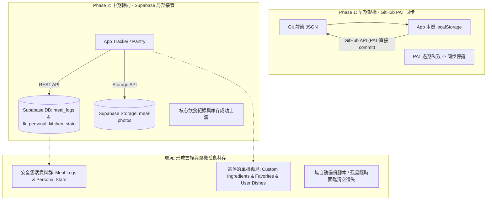

# Batch：FK-005 FK 資料位置與 SSOT 盤點

- **Batch ID**：FK-005
- **名稱**：FK 資料位置與 SSOT 盤點
- **狀態**：Closed（完成）
- **建立日期**：2026-09-27
- **結案日期**：2026-09-27
- **分支**：`docs/fk-005-data-ssot-audit`
- **目的**：全面盤點 Family Kitchen 2.0 (FK) 中所有使用者建立、修改、刪除與累積的資料，查明真實儲存位置、SSOT 歸屬、跨裝置同步能力、資料遺失風險與備份現狀，作為後續 Backup / Sync 設計之正式依據。
- **成果**：調查報告經 Bebe 驗收通過，完整建立 FK Data Map 與 A/B/C/D 四級資料風險分類，並確立後續架構與同步實作路徑。
- **邊界限制**：不修改 production code、不修改 Supabase、不建新 table/bucket、不改 localStorage、不寫 backup script、不做 migration/重構。

---

## 🎯 核心答案摘要

### 1. FK 到底有哪些資料？
FK 現存資料可分為三大族群共 13 類：
1. **飲食紀錄與圖床**：每日餐點明細 (`meal_logs`)、實拍食物照片 (`meal-photos`)、刪除餐點墓碑 (`deletedMealIds`)。
2. **個人廚房與庫存狀態**：家庭/樂樂兩套獨立的食材庫存 (`foodStockStatus`)、家用品庫存 (`supplyStockStatus` / `householdSupplies`)、採買清單 (`shoppingList`)、購物車暫存 (`foodCart`)。
3. **母庫、快捷與私房擴充**：官方食材母庫 (`ingredients.json`)、私房自訂食材 (`custom_ingredients`)、官方料理菜單 (`dishes.json`)、手機自建/修改料理、常用餐點快捷選項 (`favorite_foods.json`)、成員營養目標與設定、登入與金鑰等 Runtime 狀態。

### 2. 每份資料現在到底住哪裡、誰是 SSOT？
- **Supabase 是 SSOT 的資料**：
  - 飲食紀錄：Supabase 資料表 `meal_logs`
  - 食物照片：Supabase Storage Bucket `meal-photos`
  - 個人廚房狀態（含庫存、家用品、採買清單）：Supabase 資料表 `fk_personal_kitchen_state`（當使用者已登入時）
- **Git 靜態 JSON 是 SSOT 的資料**：
  - 官方食材母庫：`src/data/ingredients.json`
  - 官方料理菜單：`src/data/dishes.json`
  - 官方預設快捷種子：`src/data/favorite_foods.json`
  - 系統預設配置：`src/data/config.json`
- **單機 `localStorage` 成為「無奈 SSOT」的資料（沒有任何雲端與 Git 備份）**：
  - 私房自訂食材：`kitchen_v2_custom_ingredients`
  - 自訂常用餐點快捷：`kitchen_v2_favorite_foods.json`
  - 手機端自建／修改料理：`kitchen_v2_dishes.json`（線上環境無法 POST 回 Git，亦無 DB）
  - 餐點刪除墓碑：`kitchen_v2_deleted_meal_ids`

### 3. 哪些資料現在真的可能永久遺失？
- **極高風險（Local-only，清除 Safari/PWA 暫存或更換手機即 100% 永久蒸發）**：
  1. **私房自訂食材 (`kitchen_v2_custom_ingredients`)**：使用者手動新增的私房食材與通路規格，雲端完全無表、Git 無檔。
  2. **自訂常用餐點快捷 (`kitchen_v2_favorite_foods.json`)**：使用者新增的所有餐點快捷按鈕，無 Supabase、無雲端。
  3. **手機端自建／編輯之食譜 (`kitchen_v2_dishes.json`)**：在 iPhone 上自創的新菜色或修改的份量，線上無法寫回 Git，完全只在本地快取。
- **次高風險（依賴單一雲端實體，缺乏 Snapshot / Rollback 備份機制）**：
  - `meal_logs`、`meal-photos` 與 `fk_personal_kitchen_state`：雖然已上雲，但**全專案目前沒有任何定時導出、冷備份或歷史版本還原機制**。若 Supabase 人為誤刪或資料表毀損，無法回滾歷史狀態。

---

## 🗺️ FK Data Map（完整資料盤點地圖）

| 資料項目 (Data) | 目前 SSOT | Git 靜態 JSON | Supabase (Table / Bucket) | localStorage (Key) | Device-only? | Cross-device? | 恢復來源 (Restore Source) | 遺失風險等級 | 備份狀態 (Backup Status) |
| :--- | :--- | :--- | :--- | :--- | :--- | :--- | :--- | :--- | :--- |
| **1. 飲食紀錄 (Meal Logs)** | **Supabase** | `src/data/daily_logs.json` (僅種子/舊歷史) | Table: `meal_logs` | `kitchen_v2_daily_logs.json` (離線快取) | 否 | **是** (登入同帳號) | Supabase `meal_logs` 查詢重建 | **B (缺備份)** | 無定時導出備份；依賴 Supabase 單點 |
| **2. 餐點實拍照片 (Meal Photos)** | **Supabase** | 無 (二進位圖檔) | Bucket: `meal-photos` | 無 (禁止存放 Base64) | 否 | **是** (公開 CDN URL) | Supabase Storage URL | **B (缺備份)** | 無本地冷備份；依賴 Bucket 單點 |
| **3. 個人廚房狀態 - 庫存 (Pantry Food Stock)** | **Supabase** (登入後) / 本地 (未登入) | `src/data/pantry_inventory.json` (僅預設種子) | Table: `fk_personal_kitchen_state` (`pantry_inventory.foodStockStatus`) | `kitchen_v2_personal_state_{scope}` (`household` / `ariel`) | 否 (登入) / 是 (未登入) | **是** (依 scope_id 同步) | Supabase 遠端 row (冷啟動自動拉取) | **B (登入) / C (未登入)** | 本地僅留單次 `_backup` 快照；無歷史快照備份 |
| **4. 個人廚房狀態 - 家用品 (Household Supplies)** | **Supabase** (登入後) / 本地 (未登入) | `src/data/household_supplies.json` (僅預設種子) | Table: `fk_personal_kitchen_state` (`household_supplies`) | `kitchen_v2_personal_state_{scope}` | 否 (登入) / 是 (未登入) | **是** (依 scope_id 同步) | Supabase 遠端 row | **B (登入) / C (未登入)** | 同上，無歷史快照備份 |
| **5. 個人廚房狀態 - 採買與購物車 (Shopping & Cart)** | **Supabase** (登入後) / 本地 (未登入) | 內嵌於靜態 `pantry_inventory.json` | Table: `fk_personal_kitchen_state` (`shoppingList`, `foodCart`) | `kitchen_v2_personal_state_{scope}` | 否 (登入) / 是 (未登入) | **是** (依 scope_id 同步) | Supabase 遠端 row | **B (登入) / C (未登入)** | 同上，無歷史快照備份 |
| **6. 常用餐點快捷 (Favorite Foods)** | **localStorage** | `src/data/favorite_foods.json` (僅 3 筆官方預設) | **無** | `kitchen_v2_favorite_foods.json` | **是** | **否** (單機獨立) | 靜態 JSON (但使用者自訂項無法恢復) | **C (高風險)** | **完全無備份**；清快取立即回歸官方 3 筆預設 |
| **7. 私房自訂食材 (Custom Ingredients)** | **localStorage** | 無 | **無** | `kitchen_v2_custom_ingredients` | **是** | **否** (單機獨立) | **無** (清快取即永久消失) | **C (高風險)** | **完全無備份** |
| **8. 官方食材母庫 (Base Ingredients)** | **Git 靜態 JSON** | `src/data/ingredients.json` | **無** | `kitchen_v2_ingredients.json` (本機快取+通路合併) | 否 | **是** (靜態下發) | Git Repo 靜態檔 | **A (已安全)** | Git 版本控制保存完整歷史 |
| **9. 官方料理食譜 (Dishes / Menu)** | **Git 靜態 JSON** | `src/data/dishes.json` | **無** | `kitchen_v2_dishes.json` (本機快取) | 否 | **是** (靜態下發) | Git Repo 靜態檔 | **A (已安全)** | Git 版本控制保存完整歷史 |
| **10. 手機自建／修改料理 (User Dishes)** | **localStorage** | 無法線上寫回 Git | **無** | `kitchen_v2_dishes.json` (增量合併進本機) | **是** | **否** (單機獨立) | **無** (清快取後退回官方菜單) | **C / D (高風險/覆蓋)** | **完全無備份** |
| **11. 餐點刪除墓碑 (Deleted Meal IDs)** | **localStorage** | 無 | **無** (直接 DELETE 遠端列) | `kitchen_v2_deleted_meal_ids` | **是** | **否** (單機過濾) | **無** | **C (墓碑丟失)** | 無備份；若雲端 DELETE 失敗且本地遺失墓碑，舊餐點可能復活 |
| **12. 成員營養目標 (Nutrition Targets)** | **前端代碼寫死** | 無 | **無** | 無 | 否 | **是** (代碼版本下發) | 前端程式碼常量 (`TrackerView.js`) | **A (已安全)** | Git 版本控制 |
| **13. 系統通用設定 (Config & Stores)** | **Git 靜態 JSON** | `src/data/config.json` | **無** | `kitchen_v2_config.json` | 否 | **是** | Git Repo 靜態檔 | **A (已安全)** | Git 版本控制 |
| **14. 驗證金鑰與 Session (Auth State)** | **localStorage** | 無 | Supabase Auth Session | `family_kitchen_auth_session`, `_profile`, `google_id_token` | **是** | **否** (本機 Session) | 重新登入 (Google / OTP) | **A (可重登)** | 具暫態性質，無須備份 |

---

## 🚦 四級資料分類評估

### 【A. 已安全】
> 特徵：具有可靠 SSOT（Git 版本控制或代碼常量），不依賴單一裝置，重裝後可 100% 完整恢復。
1. **官方食材母庫 (`src/data/ingredients.json`)**：Git 追蹤，2183 行結構化食材資料。
2. **官方料理食譜 (`src/data/dishes.json`)**：Git 追蹤，完整官方菜單與推薦配方。
3. **成員營養目標 (`TrackerView.js` 常量)**：Bebe、Ariel、Jason 營養目標已在代碼中固定版本化。
4. **系統通路與單位設定 (`src/data/config.json`)**：全聯、好市多等通路定義受 Git 保障。

### 【B. 有雲端資料但缺 Backup】
> 特徵：Supabase 扮演有效 SSOT，跨裝置與冷啟動恢復皆正常，但**完全缺乏獨立 Snapshot / 備份導出腳本**，存在單點災難風險。
1. **飲食紀錄 (`meal_logs` table)**：
   - 記錄於 Supabase PostgreSQL 中，前端透過 REST API 讀寫。
   - 雖然換機可自動拉回，但目前**沒有任何定時 backup script 或 pg_dump / JSON 導出排程**。
2. **餐點照片圖床 (`meal-photos` storage bucket)**：
   - 圖片直傳 Supabase Storage，網址存於 `meal_logs.photo_url`。
   - 同樣缺乏遠端物件冷備份（Cold Storage Backup）。
3. **個人廚房狀態 (`fk_personal_kitchen_state` table)**：
   - 儲存 `household` 與 `ariel` 兩大 scope 之 pantryInventory、householdSupplies。
   - 登入狀態下跨裝置同步順暢，冷啟動可自動恢復；但若 Supabase 該列被誤覆蓋或錯誤 PATCH，目前僅有本地單次的 `_backup` localStorage key，缺乏雲端歷史版本回復能力。

### 【C. Local-only 高風險（隨時面臨永久遺失）】
> 特徵：資料 100% 僅留存在單一裝置的 `localStorage`，完全沒有任何雲端同步或 Git 備份，**Safari 快取清理、PWA 移除或換機時，資料瞬間蒸發**。
1. **自訂私房食材 (`kitchen_v2_custom_ingredients`)**：
   - 使用者在手機上透過 UI 手動新增的自訂食材。
   - 程式邏輯僅 `localStorage.setItem('kitchen_v2_custom_ingredients', ...)`，完全沒有 Supabase 表。
2. **自訂常用餐點快捷 (`kitchen_v2_favorite_foods.json`)**：
   - 使用者在 TrackerView 建立的快捷餐點按鈕。
   - 雖然 FK-001 解決了「隔日被靜態檔覆寫」問題，但本質依然是純單機 localStorage，無雲端表，換機或清快取即消失。
3. **手機端自建／編輯之料理 (`kitchen_v2_dishes.json`)**：
   - 使用者若在手機端新增料理或調整 memberPortions，線上環境無法 POST 回 Git，完全仰賴本地 `kitchen_v2_dishes.json`。
4. **餐點刪除墓碑 (`kitchen_v2_deleted_meal_ids`)**：
   - 記錄已刪除之餐點 ID。一旦快取被清空，離線時若重新拉取舊快照，已刪除項目可能產生靈異復活現象。

### 【D. 架構不清 / 有覆蓋風險】
> 特徵：存在多個來源（Git 靜態、localStorage 快取、Supabase），合流邏輯複雜，特定條件下可能互相污染或覆蓋。
1. **`dishes.json` 與 `ingredients.json` 之靜態與本機合併機制**：
   - `KitchenEngine.mergeUserState()` 會嘗試比對 `serverData` 與 `localData`。
   - 若未來 Git 靜態檔大幅更新欄位，而使用者本機留有舊版快取，Map 合併策略是以 local 優先覆蓋 server (`{ ...sDish, ...lDish }`)，可能導致使用者永遠吃不到母庫更新的修正數值。
2. **Personal Kitchen State 的首次登入遷移邊界**：
   - 依賴 `cloudTime > localTime` 以及 `hasPersonalKitchenData` 判斷。若使用者在未登入離線狀態下維護了大量庫存，隨後登入一個已有舊資料的帳號，可能發生時間戳比對異常導致單向覆蓋。

---

## 🔍 五大專題深度調查報告

### 專題 1：`favorite_foods.json`
1. **localStorage 與 Git JSON 各扮演什麼角色？**
   - `src/data/favorite_foods.json` (Git)：**僅為初始預設種子**（內建「美式炒蛋」、「烤吐司片」、「希臘優格佐莓果」3 筆）。
   - `kitchen_v2_favorite_foods.json` (localStorage)：**實際執行期的 Active Store**。新增、刪除快捷皆在此 key 進行讀寫。
2. **是否仍完全沒有 Supabase？**
   - **完全沒有**。Supabase 中沒有任何 favorite_foods 資料表或欄位。
3. **Bebe / Ariel 是否共用同一份 device-local 資料？**
   - **是**。常用快捷未被納入 Personal Kitchen Scope (`household`/`ariel`)，亦未綁定 `currentMember`。在同一台手機/瀏覽器中，不論切換到 Bebe 還是 Ariel，讀取的都是同一個 key。
4. **冷啟動時實際載入流程是什麼？**
   - `initialize()` 呼叫 `fetchJson('favorite_foods.json')`。
   - 因 FK-001 將其加入 `isUserStateFile()`，當本地已有 `kitchen_v2_favorite_foods.json` 時，`mergeUserState` 會直接採用本機資料，不再被靜態 JSON 覆寫。
5. **localStorage 被清掉會發生什麼？**
   - **使用者自訂快捷全數永久遺失**。App 回退至讀取 Git 靜態 JSON，介面恢復為官方初始的 3 筆預設快捷。

---

### 專題 2：`kitchen_v2_custom_ingredients`
1. **是否仍為 localStorage only？**
   - **是**。代碼中所有新增、編輯與清洗 (`cleanDuplicateIngredients`)，目標均為 `localStorage.getItem('kitchen_v2_custom_ingredients')`。
2. **是否完全沒有跨裝置／雲端備份？**
   - **完全沒有**。`CloudSyncEngine`（GitHub 同步）已全域關閉 (`enabled = false`)，Supabase 中亦未建立 custom ingredients 表。
3. **若手機 PWA 被刪除，資料是否永久遺失？**
   - **是，100% 永久遺失**。沒有任何二次備份或雲端留存。

---

### 專題 3：Personal Kitchen State (`fk_personal_kitchen_state`)
1. **`fk_personal_kitchen_state` 實際涵蓋哪些資料？**
   - 涵蓋 2 大 JSON 欄位與 2 個中繼欄位：
     - `pantry_inventory`：內含 `foodStockStatus` (食材庫存勾選)、`supplyStockStatus` (耗品狀態)、`shoppingList` (採買清單)、`foodCart` (計算機購物車)。
     - `household_supplies`：內含 `supplies` (家用品明細、通路、購買規格)。
     - `version`：版本遞增計數器。
     - `updated_at`：最後修改時間戳。
2. **household 與 ariel scope 各包含什麼？**
   - `household`：Bebe 與 Jason 共用之廚房庫存、家用品與採買清單。
   - `ariel`：樂樂獨立的租屋處/個人廚房庫存、家用品與專屬採買清單。
   - 兩者在 Supabase 資料表中各佔一列 (`scope_id = 'household'` 與 `scope_id = 'ariel'`)。
3. **local cache 與 Supabase 誰是 SSOT？**
   - **登入狀態下：Supabase 是 SSOT**。本地 `kitchen_v2_personal_state_{scope}` 僅為離線快取。
   - **未登入狀態下：localStorage 為孤島 SSOT**，無法同步上雲。
4. **初始化／同步／restore 流程實際怎麼走？**
   - **寫入流程**：前端修改庫存 -> `persistPersonalKitchenState()` 寫入本地 -> 產生本地 `_backup` 快照 -> `syncPersonalKitchenState()` 向 Supabase 發送 `PATCH`。
   - **讀取/恢復流程**：App 啟動時先讀取本地快取顯示介面（秒開）；隨後發送 `getState(scopeId)` 向 Supabase 查詢。若遠端 `updatedAt > localAt`，以雲端狀態覆蓋本地快取並重新渲染。
   - **本機防禦**：`writePersonalKitchenState` 每次寫入前會自動備份前一次狀態至 `kitchen_v2_personal_state_{scopeId}_backup`，可用於單次崩潰恢復。

---

### 專題 4：`meal_logs` 與 `meal-photos`
1. **Supabase 是否是真正 SSOT？**
   - **是**。資料庫表 `meal_logs` 是唯一具備即時跨裝置與持久特性的真實來源。
2. **localStorage 是否只是 cache？**
   - **是**。`kitchen_v2_daily_logs.json` 僅作為前端秒開的讀取快取與離線暫存。在 `TrackerView` 切換日期時，均會觸發 `fetchMealsFromSupabase` 向雲端同步最新餐點。
3. **meal-photos 使用哪個 bucket？**
   - 使用 Supabase Storage Bucket：`meal-photos`。
   - 照片路徑規則為：`meals/{member}_{dateStr}_{timeStr}.{ext}`。
   - 上傳成功後取得公開 CDN 網址，並回填至 `meal_logs.photo_url`。
4. **若 App local data 清掉，meal logs / photos 是否可完整恢復？**
   - **可以完整恢復**。重新開啟 PWA 並切換日期，前端會自 Supabase `meal_logs` 拉回餐點營養素、名稱與 `photo_url`，照片直接向 Supabase Storage 讀取，毫髮無傷。

---

### 專題 5：`backups/` 目錄真實現況
1. **現有 2026-08-12 backup 到底備份了哪些資料？**
   - 檔案清單：
     - `daily_logs.json` (94 行，含 8/12 當日幾筆早期餐點)
     - `dishes.json` (279 行)
     - `household_supplies.json` (47 行)
     - `ingredients.json` (643 行)
     - `pantry_inventory.json` (82 行)
2. **每個 JSON 是從哪個來源抓的？**
   - 經代碼比對，此 5 個檔案為 **2026-08-12 當時開發環境中的 `src/data/*.json` 靜態檔案複製本**，反映的是當日尚未遷移至 Supabase 前的舊版狀態。
3. **當時使用什麼 script / command 建立？**
   - 專案內**沒有任何備份腳本**。git log 亦無紀錄。這是當時工程師手動執行檔案複製 (`cp`) 的快照。
4. **`extracted_photos_20260917` 是什麼？**
   - 2026-09-17 處理「Base64 照片塞爆 JSON」問題時，暫存抽離出之 4 張實體 jpg 圖檔及 3.9MB 的 `daily_logs_original_backup.json`，屬於一次性除錯產物。
5. **是否還有可重用的舊 backup script？**
   - **完全沒有**。全專案未曾撰寫過自動備份腳本。
6. **為什麼 8/12 之後停止？**
   - 1. `backups/` 目錄被列入 `.gitignore:13`，從未納入 Git 版本追蹤。
   - 2. 8 月中旬後架構轉向 Supabase，開發焦點移至 `meal_logs` 與 `fk_personal_kitchen_state`，原有的「本機檔案複製法」被遺忘且停止維護。
   - 3. 缺乏專門的排程機制（如 GitHub Actions 或伺服器 cron）來自動導出雲端資料。

---

## 🏛️ 架構演進歷史脈絡（為什麼變成今天這樣？）

---

## 💡 後續 Batch 規劃建議（不實作）

根據本次盤點之真實風險分布與資料流迫切性，後續改善順序規劃如下：

### 1. FK-006：Local-only 高風險資料上雲架構設計
- **核心目標**：先完成 Category C（`custom_ingredients`、`favorite_foods`、手機端自建料理）上雲之資料模型與架構設計，消除 Safari 清除快取或換機時資料永久遺失的最致命隱患。
- **規劃範疇**：
  - 評估並決定資料載體方案（擴充 `fk_personal_kitchen_state` JSON 結構 vs 建立獨立 Supabase table）。
  - 定義資料結構、Scope 歸屬（個人/家庭）、同步時機與衝突解決策略。
  - 產出正式架構設計規格，作為實作依據。

### 2. FK-007：Local-only → Supabase sync 實作
- **核心目標**：依據 FK-006 的架構設計，正式實作資料上雲與跨裝置雙向同步。
- **實作範疇**：
  - 實作私房自訂食材 (`custom_ingredients`) 與常用餐點快捷 (`favorite_foods`) 之 Supabase 同步與持久化。
  - 建立冷啟動載入、本地快取更新與寫入推播邏輯。
  - 實機驗證換機與清空本機快取後，自訂資料能完整還原。

### 3. FK-008：Supabase 自動 snapshot / cold backup
- **核心目標**：解決 Category B 雲端資料（`meal_logs`、`meal-photos`、`fk_personal_kitchen_state`）缺乏災難還原與歷史回滾備份的問題。
- **規劃範疇**：
  - 建立獨立輕量的備份導出腳本（JSON Snapshot），定期備份 Supabase 雲端資料。
  - 建立歷史版本備份歸檔與還原驗證機制。

### 4. 後續 Batch：deleted tombstone / offline merge / cache override 等 sync correctness
- **核心目標**：解決 Category D 的同步正確性與邊界風險。
- **規劃範疇**：
  - 餐點刪除墓碑 (`deleted_meal_ids`) 雲端同步化，防範本地墓碑遺失導致舊餐點復活。
  - 健全官方母庫靜態 JSON 與本地快取的 Merge 策略，防範舊快取覆蓋母庫重大更新。
  - 離線切換線上時之時間戳與版本合流邊界保護。
